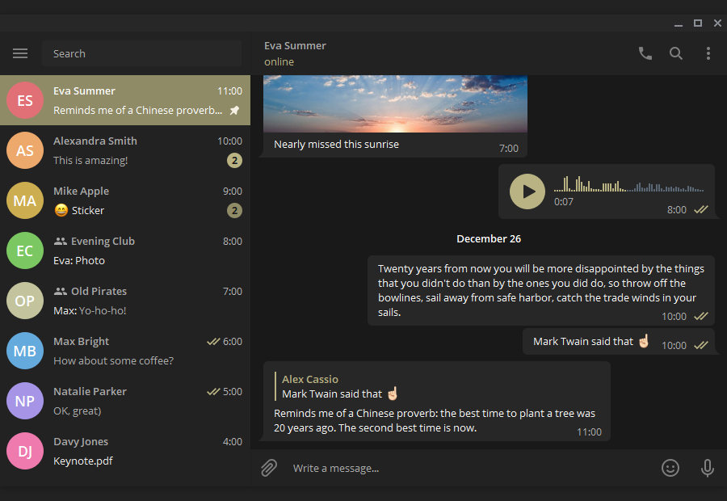
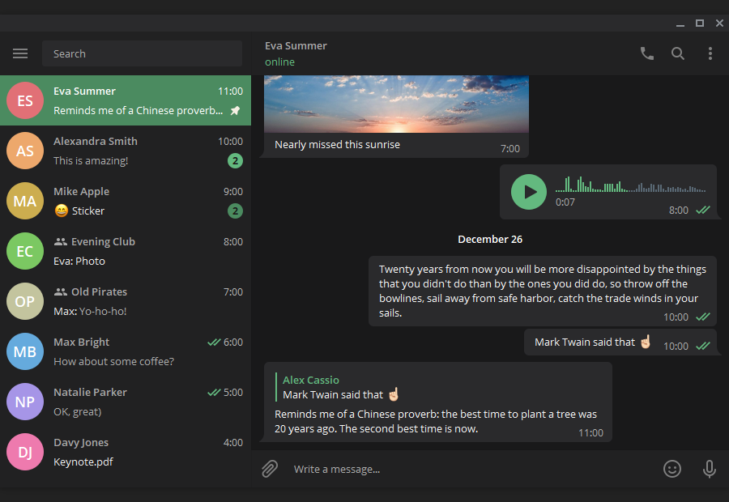
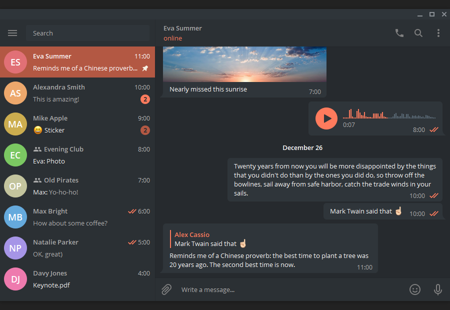

   
  
  
  
  
  

**[This theme for Telegram Web](https://github.com/VChet/Telegram-Vanilla-Dark-Web)**

## Preview

  
  
  
  
  
  
  
  

## Development

1. [Fork](https://github.com/VChet/Telegram-Vanilla-Dark-Desktop/fork) and download this repository
1. Install [Node.js](https://nodejs.org/)
1. Install dependencies `npm install`
1. Change colors in [one of the themes or add your own](themes.js)
1. Change or add theme constants in [mappings](mappings.js)
1. Generate theme with `npm run generate <theme-name>`
1. Check your theme in Telegram. `Settings > Chat Settings > Create new theme > Import existing theme > <palette-file>`
1. Commit and push your changes
1. Make a pull request
