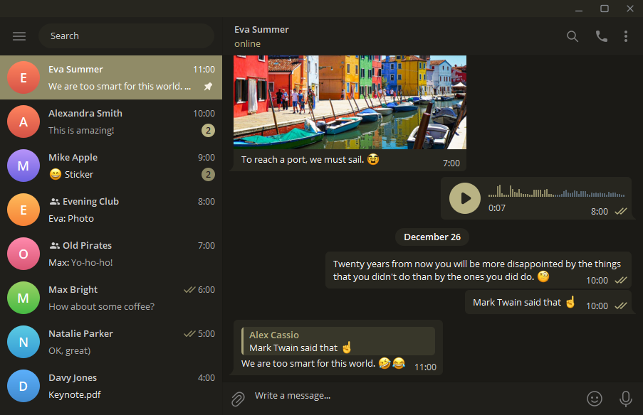
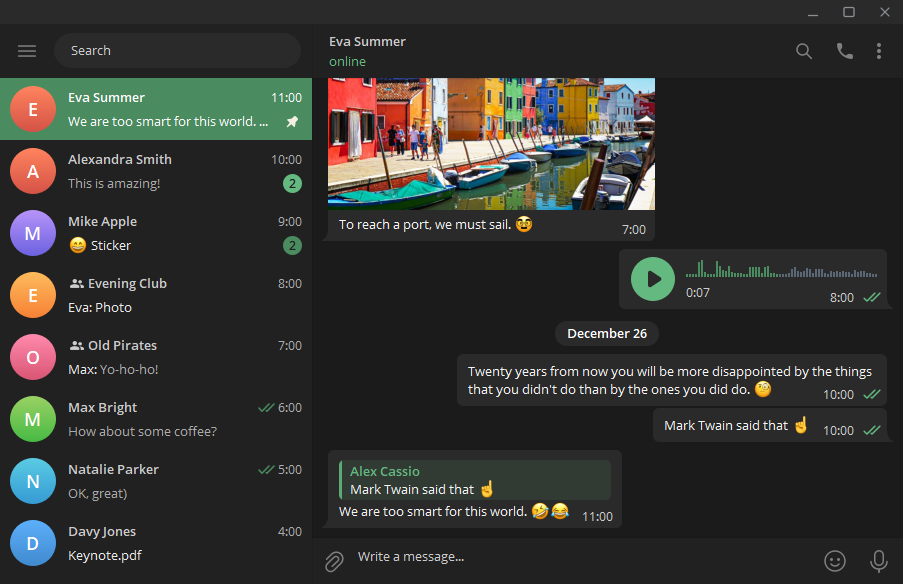
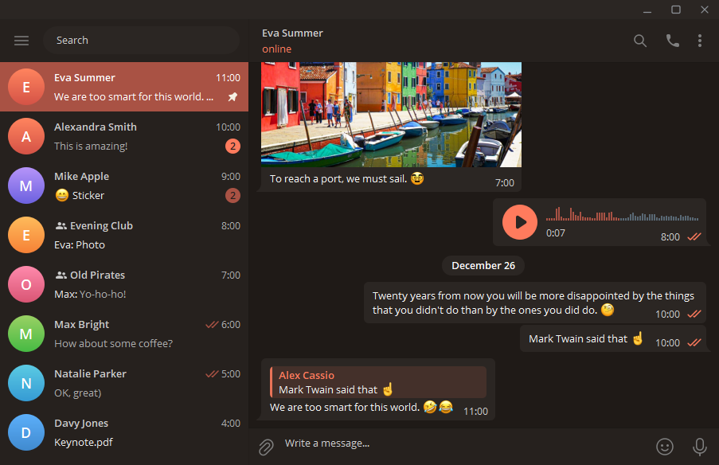

# Telegram Vanilla Dark Desktop

[![releases][releases-img]][releases-url]
[![build-status][build-img]][build-url]
![prs-welcome][prs-welcome-img]

## Preview

  
  
  
  
  
  
  
  

## Development

1. [Fork][fork-url] and download this repository
1. Install [Node.js](https://nodejs.org/)
1. Install [pnpm](https://pnpm.io/)
1. Install dependencies `pnpm install`
1. Change colors in [one of the themes or add your own](/src/themes.ts)
1. Change or add theme constants in [mappings](/src/mappings.ts)
1. Generate theme with `npm run generate <theme-name>`
1. Check generated theme in Telegram
`Settings > Chat Settings > Create new theme > IMPORT EXISTING THEME > <palette-file>`
1. Commit and push your changes
1. Make a pull request

<!-- Badges -->
[releases-url]: https://github.com/VChet/telegram-vanilla-dark-desktop/releases
[releases-img]: https://img.shields.io/github/tag/VChet/telegram-vanilla-dark-desktop?label=version&style=flat-square
[build-url]: https://github.com/VChet/telegram-vanilla-dark-desktop/actions/workflows/build.yaml
[build-img]: https://img.shields.io/github/actions/workflow/status/VChet/telegram-vanilla-dark-desktop/.github/workflows/build.yaml?style=flat-square
[prs-welcome-img]: https://img.shields.io/badge/PRs-welcome-brightgreen?style=flat-square
<!-- Links -->
[fork-url]: https://github.com/VChet/telegram-vanilla-dark-desktop/fork
