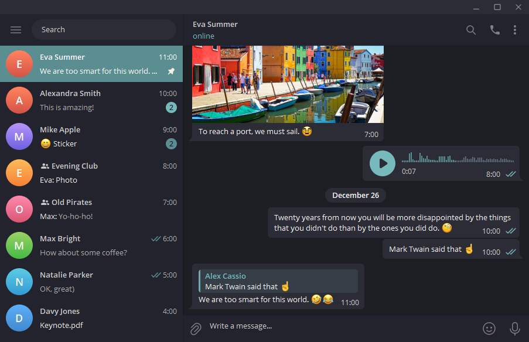

<p align="center">
  <br/>
  <a href="https://github.com/VChet/telegram-vanilla-dark-desktop/tags">
    
  </a>
  <a href="https://github.com/VChet/telegram-vanilla-dark-desktop/actions/workflows/test.yml">
    
  </a>
  <a href="https://makeapullrequest.com">
    
  </a>
</p>

## Preview

<div align="center">
  <a href="./meta/aqua.png">
    
  </a>
  <a href="./meta/cream.png">
    
  </a>
  <a href="./meta/green.png">
    
  </a>
  <a href="./meta/red.png">
    
  </a>
  <a href="https://t.me/addtheme/vanilla_dark_aqua">
    
  </a>
  <a width="23%" href="https://t.me/addtheme/vanilla_dark_cream">
    
  </a>
  <a width="23%" href="https://t.me/addtheme/vanilla_dark_green">
    
  </a>
  <a width="23%" href="https://t.me/addtheme/vanilla_dark_red">
    
  </a>
</div>

## Development

1. [Fork](https://github.com/VChet/telegram-vanilla-dark-desktop/fork) and download this repository
1. Install [Node.js](https://nodejs.org/)
1. Install dependencies `npm install`
1. Change colors in [one of the themes or add your own](/src/themes.ts)
1. Change or add theme constants in [mappings](/src/mappings.ts)
1. Generate theme with `npm run generate <theme-name>`
1. Check generated theme in Telegram.

   ```txt
   Settings > Chat Settings > Create new theme > IMPORT EXISTING THEME > <palette-file>
   ```

1. Commit and push your changes
1. Make a pull request
